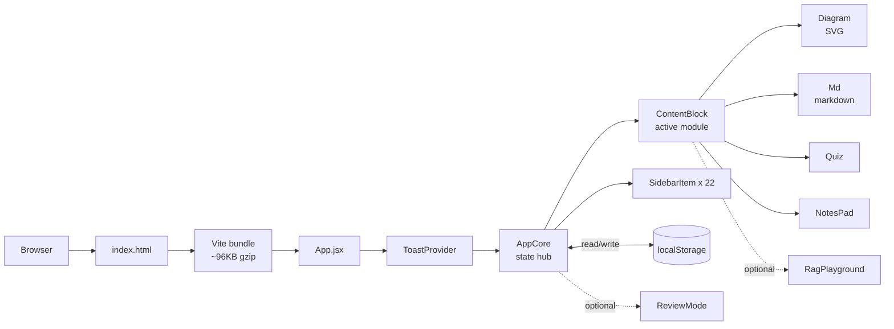

<p align="center">
  
</p>

<h1 align="center">Agentic AI Navigator</h1>

<p align="center">
  <strong>An interactive, self-paced learning platform for mastering Agentic AI: from LLM fundamentals through production-grade multi-agent systems.</strong>
</p>

<p align="center">
  
  
  
  
  
  
  
</p>

<p align="center">
  A browser-based course that takes the reader from "what is a token" to "how do I observe a multi-agent production system" across 22 modules and 6 phases. No backend, no signup, no paywall: open the page, answer the quiz, advance.
</p>

## Table of Contents

- [The Problem](#the-problem)
- [The Solution](#the-solution)
- [Who It Is For and Use Cases](#who-it-is-for-and-use-cases)
- [Key Features](#key-features)
- [Demo](#demo)
- [Architecture](#architecture)
- [Tech Stack](#tech-stack)
- [Prerequisites](#prerequisites)
- [Installation](#installation)
- [Configuration](#configuration)
- [Running the App](#running-the-app)
- [Using the App Step by Step](#using-the-app-step-by-step)
- [Code Walkthrough](#code-walkthrough)
- [Sample Data](#sample-data)
- [Customization](#customization)
- [Troubleshooting](#troubleshooting)
- [Project Structure](#project-structure)
- [Deployment](#deployment)
- [Security Notes](#security-notes)
- [Contributing](#contributing)
- [License](#license)
- [Acknowledgments](#acknowledgments)

## The Problem

People who need to ship Agentic AI systems sit on the wrong side of a steep, scattered learning curve. The good material is split across dense research papers, framework docs that assume you already understand the concepts, blog posts that go deep on one piece and skip the rest, and expensive recorded courses that are dated within months. The result:

- **Product managers and solution architects** can name "RAG" and "agents" but cannot tell when one is correct and the other is wrong.
- **Engineers** know how to call an LLM but stumble on chunking strategy, retrieval evaluation, prompt injection defences, and observability.
- **AI teams** end up reinventing the same patterns (planning loops, supervisor agents, eval harnesses) on every project.

Most learners need a structured, opinionated path that goes phase by phase, shows each idea visually, and tests retention before moving on. That path is what this project provides.

## The Solution

Agentic AI Navigator is a single-page web app that walks the reader through 22 modules grouped into 6 phases:

| Phase | Modules | Focus |
| --- | --- | --- |
| A. LLM Fundamentals | 1 to 3 | Tokens, prompts, function calling. |
| B. Agent Foundations | 4 to 8 | ReAct loops, tools, planning, memory. |
| C. RAG Deep Dive | 9 to 13 | Chunking, embeddings, hybrid retrieval, prompt assembly. |
| D. Evaluation and Security | 14 to 15 | Groundedness metrics, prompt injection defences. |
| E. Frameworks and Multi-Agent | 16 to 19 | LangChain, orchestration, supervisor patterns. |
| F. Production and Observability | 20 to 22 | Reliability, monitoring, productionization. |

Each module ships:

- A short, opinionated explanation in markdown.
- A hand-built SVG diagram with click-to-expand node descriptions.
- A 4-option quiz with deterministically shuffled answers.
- A "key takeaways" list to anchor the concept.
- An optional interactive playground (for example, the RAG evaluation slider in module 14).

Progress, XP, streaks, and per-module notes are persisted to `localStorage` so the course resumes where the reader left off.

**Before vs after**: a learner who finishes Agentic AI Navigator can explain (without notes) what hybrid retrieval is, why MMR matters, the difference between an input and an output guardrail, and what a supervisor agent does in a multi-agent graph. That is a real, testable lift.

## Who It Is For and Use Cases

The course works for three concrete personas. The bar is "comfortable reading technical writing", not "knows React".

### 1. The PM scoping an AI feature

Maya is a senior product manager at a mid-sized SaaS. Engineering keeps saying "we should add RAG" and "we need an agent" and she cannot push back because she does not know where each pattern actually fits. She works through phases A, B, and the start of C in two evenings, then can hold a real conversation about whether her search problem needs RAG, a fine-tune, or just a better keyword index.

### 2. The full-stack engineer adding AI to a product

Diego shipped his first OpenAI-powered feature last quarter. It works but it hallucinates 5% of the time and there is no plan for handling it. He works through phases C (chunking, retrieval, prompt assembly), D (groundedness and guardrails), and F (observability) in a focused weekend, then comes back to work with a concrete plan to add citations, an evaluation harness, and structured logging.

### 3. The AI engineer designing a multi-agent system

Priya is the AI lead at a startup. The product needs an agent that researches a topic and writes a report. She knows LangChain but has only built single-agent prototypes. She works through phases E (orchestration) and F (production) and walks away with the architecture (supervisor + specialist nodes + a shared State object), the failure modes she needs to budget for, and the tracing strategy she will implement first.

## Key Features

### Learning experience

- **22 modules, 6 phases, sequential unlock**. Quizzes gate progress so you cannot skip ahead by accident.
- **Hand-built SVG diagrams with node descriptions**. No animation library, no D3, no canvas. Click any node to read the deep explanation.
- **Deterministic quiz shuffle**. Same question, same option order across sessions (seeded by `stepId * 2654435761`).
- **Hint after two failed attempts**. The hint is module-specific and authored alongside the question.
- **Review Mode**. After unlocking enough modules, replay random quizzes for streak XP.
- **Per-module notes pad**. Notes are saved with a 300ms debounce and can be exported as a single markdown file from the sidebar.

### Built for the browser

- **Fully responsive**. Phones from 360px, tablets, desktops, iOS safe-area handled (notch, Dynamic Island, home indicator).
- **Keyboard shortcuts**: `N` for next module, `P` for previous.
- **ARIA labelling on every interactive element** (`role="radiogroup"`, `aria-checked`, `role="progressbar"`, `aria-current="step"`).
- **`focus-visible` outlines** so keyboard users always know where focus is.

### Performance and footprint

- **About 96KB gzipped** end-to-end (React + ReactDOM + the entire curriculum).
- **Two runtime dependencies**: `react`, `react-dom`. Nothing else.
- **Memoised leaf components** to avoid wasteful re-renders.
- **Debounced localStorage writes** so quiz answers do not pound storage.

### Intentionally not included

- **No backend.** Progress is local to the browser.
- **No analytics.** Nothing leaves the page.
- **No accounts.** No sign-in, no email, no nothing.
- **No CMS.** Curriculum lives in `src/App.jsx` so changes are diff-reviewable.

## Demo

The app runs at `http://localhost:5173` in dev mode. Once deployed (see [Deployment](#deployment)) it lives at your `*.vercel.app` or `*.netlify.app` URL.

ASCII sketch of the layout:

```
+----------------------------------------------------------------------+
| AGENTIC AI NAVIGATOR    Module 5 of 22 · Phase B    [XP][Streak][>]  |
+----------------------------------------------------------------------+
| [Sidebar]          | [Main content]                                  |
| Phase A LLM ...    |  THE AGENTIC CORE                               |
| Phase B Agents     |  ## The ReAct Loop                              |
|  - 4 Agent Basics  |                                                 |
|  - 5 ReAct  <-active|  [Animated SVG diagram with 6 nodes]            |
|  - 6 Planning      |                                                 |
|  - 7 Tools         |  Key takeaways                                  |
|  - 8 Memory        |    * Agents are proactive, not reactive         |
| Phase C RAG ...    |    * ReAct = Reason + Act                        |
| Phase D Eval ...   |                                                 |
| Phase E Frame ...  |  Knowledge check                                |
| Phase F Prod ...   |    [Quiz with 4 options]                        |
| Export Notes       |                                                 |
| Reset Progress     |  Notes pad (saved automatically)                |
+----------------------------------------------------------------------+
```

After a correct quiz answer, confetti drops, the next module unlocks in the sidebar, and the XP bar fills.

## Architecture



The app is a single React tree. `AppCore` owns navigation state, progress, XP, streak, and the notes map. `ContentBlock` is the per-module shell, composing a `Diagram`, an `Md` text block, a `Quiz`, and a `NotesPad`. Storage round-trips are isolated to two places: the progress helpers near the top of `src/App.jsx` and the `NotesPad` component.

Deeper dive: `docs/architecture.md` includes a sequence diagram of the quiz-answer flow, a "what lives where" line-range table, the trust boundaries diagram, and the invariants the design depends on.

## Tech Stack

| Layer | Tool | Why it is here |
| --- | --- | --- |
| Framework | React 19.2 | Component model and hooks. |
| Build | Vite 7.3 | Fast dev server, small Rollup bundles, ESM-first. |
| Diagrams | Hand-rolled SVG (no library) | Pure React, no D3 / canvas / graph library. |
| Styling | Inline styles + CSS variables | Theming via a single `:root` block. |
| State | `useState` / `useCallback` / `useMemo` | No Redux, no Zustand, no MobX. |
| Persistence | `localStorage` | Survives reloads and tab closes, never leaves the browser. |
| Lint | ESLint 9 flat config | `react-hooks` and `react-refresh` plugins enabled. |
| Deploy | Vercel, Netlify, Cloudflare Pages, GitHub Pages | All static; pick one. |

## Prerequisites

- **Node.js 20.19+** or **22.12+**. Vite 7 dropped Node 18. Verify with `node --version`.
- **npm 9+** (ships with Node 20). Verify with `npm --version`.
- A modern browser: Chrome 90+, Firefox 90+, Safari 15+, Edge 90+, iOS Safari 15+, Chrome Android 90+.
- About 250MB of disk for `node_modules`.

No accounts, no API keys, no environment variables.

## Installation

### Local (recommended for development)

```bash
git clone https://github.com/ANI-IN/agentic-navigator.git
cd agentic-navigator
npm install
```

### Docker (for a containerised preview)

```bash
docker build -t agentic-navigator .
docker run --rm -p 8080:8080 agentic-navigator
# open http://localhost:8080
```

The Docker image is multi-stage: stage 1 builds the Vite bundle with Node 22, stage 2 serves it from a minimal nginx with SPA fallback.

## Configuration

The app reads no environment variables and uses no secrets.

### Knobs you might want to tune

| What | Where | Default | Notes |
| --- | --- | --- | --- |
| Storage key | `src/App.jsx` `STORE_KEY` (around line 574) | `agentic-ai-nav-v5` | Bumping the suffix discards old progress (schema break). |
| XP per correct answer | `src/App.jsx`, inside `handleAnswer` | 50 | Multiplied by `steps.length` for total XP. |
| Confetti duration | `src/App.jsx`, in the `useEffect` watching `confetti` | 2200 ms | Shorter is snappier. |
| Notes debounce | `src/App.jsx`, in `NotesPad` `handleChange` | 800 ms | Quieter typing experience at higher values. |
| Welcome toast delay | `src/App.jsx`, in mount effect | 300 ms | Set to 0 to suppress. |
| Curriculum content | `src/App.jsx`, the `steps` array | 22 modules | See [Customization](#customization). |
| Phase definitions | `src/App.jsx`, the `phases` array | 6 phases | Range tuples gate which modules belong to which phase. |
| Security headers | `vercel.json`, `netlify.toml` | CSP / HSTS / etc. | Edit if you embed the app from a different origin. |

## Running the App

```bash
npm run dev      # Vite dev server with hot reload at http://localhost:5173
npm run build    # production bundle to dist/ (about 96KB gzip)
npm run preview  # serve dist/ at http://localhost:4173 (what Vercel sees)
npm run lint     # ESLint flat config
```

For Docker, see [Installation](#installation).

## Using the App Step by Step

1. Open the dev server URL (or your deployed URL).
2. Module 1 ("The Engine") is the only unlocked module on a fresh load.
3. Read the markdown explanation. Click any SVG node to expand its description.
4. Answer the knowledge-check quiz. A correct answer awards 50 XP and unlocks the next module. An incorrect answer triggers a shake animation; after two failures, a hint appears.
5. Optionally write notes in the notes pad at the bottom. They save automatically after 800ms of typing pause.
6. Click the next-module pill (or press `N`) to advance.
7. From the sidebar, click "Export My Notes" any time to download a single markdown file of all your notes.
8. Click "Reset Progress" in the sidebar footer to start over (confirmation modal blocks accidental clicks).

Keyboard shortcuts: `N` for next module, `P` for previous. Shortcuts are ignored when an input, textarea, or button is focused (so you can type "n" inside the notes pad without advancing).

## Code Walkthrough

Everything important lives in `src/App.jsx`. Line ranges below are accurate as of the latest commit; they will shift if the file is refactored.

| Range | What | Notes |
| --- | --- | --- |
| 1-14 | `triggerHaptic` | Tiny helper that calls `navigator.vibrate` on supported devices. |
| 19-26 | `phases` | Six phase descriptors with colours, icons, and id ranges. |
| 28-568 | `steps` | The 22 modules. Each has `markdownContent`, `keyTakeaways`, `diagram`, and `activity`. |
| 573-586 | `defaultState`, `STORE_KEY`, `loadFromStorageSync`, `saveToStorage` | Storage helpers. The `v5` suffix on the key means the schema has been broken (and old keys discarded) four times. |
| 591-620 | `ToastProvider`, `useToast` | Lightweight notification context. |
| 625-637 | `CSS_VARS` | CSS custom properties (background, text, accent colours). |
| 642-815 | `Diagram` | Hand-built SVG renderer with Bezier-curved edges and click-to-expand node descriptions. Memoised. |
| 820-895 | `NotesPad` | Per-module notes pad with debounced save and an optional clear button. Memoised. |
| 900-979 | `RagPlayground` | Interactive RAG-eval slider used in module 14. Memoised. |
| 984-1011 | `ContentBlock` | The per-module shell: theory / code toggle, then markdown, then quiz. Memoised. |
| 1016-1030 | `Md` | Regex-based markdown to HTML. Today the only inputs come from the developer-authored `steps` array. |
| 1035-1144 | `Quiz` | Seeded option shuffle, hint reveal after two failures, success animation, deterministic across sessions. Memoised. |
| 1149-1192 | `ReviewMode` | Endless random-quiz mode that awards streak XP. |
| 1197-1218 | `SidebarItem` | Per-step sidebar entry with locked / active / done / has-note state. Memoised. |
| 1223-1565 | `AppCore` | Main shell: header, sidebar, content area, keyboard shortcuts, reset modal, export. Owns all top-level state. |
| 1570-1613 | `GLOBAL_STYLES` | Animations and responsive helpers. |
| 1617-1618 | `export default function App()` | Just wraps `AppCore` in the `ToastProvider`. |

For a sequence diagram of "user clicks an option, app awards XP, unlocks the next module", see `docs/architecture.md`.

## Sample Data

The curriculum ships in `src/App.jsx`, lines 28-568. There are 22 module objects. Each follows the same shape:

```js
{
  id: 5,
  phase: "B",
  title: "The Agentic Core",
  conceptName: "The ReAct Loop",
  icon: "⚡",
  markdownContent: "### Moving Beyond Chatbots\n...",
  keyTakeaways: ["Agents are proactive, not just reactive", "..."],
  diagram: {
    nodes: [
      { id: "user", label: "User", type: "terminal", x: 0, y: 0.5, description: "The human providing the initial goal..." },
      // ...
    ],
    edges: [
      { from: "user", to: "thought", label: "Request" },
      // ...
    ]
  },
  activity: {
    question: "In the ReAct framework, what does the agent do immediately after executing a Tool?",
    options: ["Returns output directly to the user.", "Observes the output and reasons about what to do next.", "Erases its memory.", "Waits for human input."],
    correctIndex: 1,
    explanation: "After an action, the agent MUST observe the result and feed it back into its reasoning process.",
    hint: "Think about the cycle: Reason -> Act -> ???"
  }
}
```

Optional fields a module can have:

- `codeSnippet`: a string shown in the "Code" tab (see modules 7, 13, 16, 17 for examples).
- `playground`: an object describing an interactive component (used by module 14).

Try this: open the dev server, advance to module 5 ("The ReAct Loop"), click each of the six nodes in the diagram to read its description, then answer the quiz.

## Customization

### Add a new module

Open `src/App.jsx`, find the `steps` array (line 28), copy the last entry, increment `id`, set the `phase`, and adjust the appropriate phase's `range` tuple in `phases` (line 19) so the sidebar groups it correctly.

### Change theme colours

Edit `CSS_VARS` at `src/App.jsx:625-637`. Every coloured element pulls from these custom properties; changing the values here propagates everywhere.

### Add a new phase

Append a new entry to the `phases` array at `src/App.jsx:19-26`. Pick an unused phase id (a single letter, current pattern is A-F), a colour, an icon, and a `range` tuple covering the module ids the phase contains.

### Replace the markdown renderer

The current `Md` component at `src/App.jsx:1016-1030` is a regex pipeline that builds HTML and feeds it to `dangerouslySetInnerHTML`. It is safe today because every input string is developer-authored. If you ever feed user-supplied or remote-fetched text through `Md`, replace it with `marked` plus `DOMPurify` first. The audit report at `improvements/security-review.md` (SEC-01) has the migration plan.

## Troubleshooting

| Symptom | Likely cause | Fix |
| --- | --- | --- |
| `npm run dev` fails with "vite: Node 18 not supported" | You are on Node 18 or earlier. | Install Node 20.19 or 22.12 (use nvm: `nvm install 22 && nvm use 22`). |
| The page loads but is blank | A JavaScript error in the bundle. | Open DevTools console. If you see a content-security-policy violation, the local preview is enforcing the production CSP; use `npm run dev` instead of `npm run preview`. |
| Quizzes always show the same option order | That is correct. The shuffle is seeded by step id so the order is deterministic. | Not a bug. |
| Progress resets after a few weeks | You either cleared site data, your browser pruned localStorage, or the `STORE_KEY` was bumped in a new release (the `v5` suffix). | Re-do the modules. There is no recovery path. |
| Notes pad shows "Saved" but the export is empty | The notes were saved under a different `stepId` than the export is reading. Most likely cause: you have the app open in two tabs. | Close other tabs and re-export. |
| `npm run build` succeeds but Vercel preview is broken | The CSP in `vercel.json` is blocking something the dev server allowed (Google Fonts, inline scripts). | Look at the browser console for the CSP violation, then loosen the relevant directive in `vercel.json` and redeploy. |
| Confetti animation is glitchy | The confetti specs are generated at the moment the quiz is answered. Hard reload (Ctrl+Shift+R / Cmd+Shift+R) clears the React state. | Hard reload. |
| Diagrams overflow on a small screen | Width is below the 360px design floor (some Android keyboards push the layout). | Rotate to landscape or close the keyboard. |

If none of the above matches, open an issue using `.github/ISSUE_TEMPLATE/bug_report.md`. Include the browser console output.

## Project Structure

```
agentic-navigator/
├── .editorconfig                # consistent indentation
├── .github/
│   ├── ISSUE_TEMPLATE/
│   │   ├── bug_report.md
│   │   └── feature_request.md
│   ├── PULL_REQUEST_TEMPLATE.md
│   └── workflows/
│       └── ci.yml               # lint + build on Node 20 and 22
├── .gitignore
├── CHANGELOG.md
├── CODE_OF_CONDUCT.md
├── CONTRIBUTING.md
├── Dockerfile                   # multi-stage: Node 22 build -> nginx serve
├── LICENSE                      # MIT
├── README.md                    # this file
├── SECURITY.md
├── docs/
│   ├── architecture.md          # mermaid diagrams + line-range map
│   └── getting-started.md       # local setup + QA checklist
├── eslint.config.js             # ESLint 9 flat config
├── improvements/                # advisory audit, evidence-based
│   ├── IMPROVEMENT_PLAN.md      # read this first
│   ├── accessibility-and-ux.md
│   ├── code-review.md
│   ├── dependencies.md
│   ├── performance-review.md
│   ├── security-review.md
│   ├── testing-gaps.md
│   └── tech-debt-and-refactoring.md
├── index.html                   # HTML shell with OG / Twitter card meta
├── netlify.toml                 # SPA redirect + security headers
├── package.json                 # name, engines, scripts, deps
├── public/
│   └── vite.svg                 # favicon (placeholder)
├── src/
│   ├── App.css                  # legacy Vite template (unused)
│   ├── App.jsx                  # the entire app, well-commented
│   ├── assets/
│   │   └── react.svg            # template artifact
│   ├── index.css                # body + button base styles
│   └── main.jsx                 # ReactDOM root
├── vercel.json                  # SPA rewrite + security headers
└── vite.config.js               # Vite config
```

## Deployment

All four options below ship the same 96KB-gzip bundle. Pick the one you already have an account on.

### Vercel (recommended)

1. Push to GitHub.
2. Sign in at https://vercel.com with your GitHub account.
3. Click "Add New Project", import the repo.
4. Vercel auto-detects Vite; leave the defaults and click "Deploy".
5. Live at `https://<project>.vercel.app` in under a minute.

`vercel.json` already configures SPA rewrites, asset caching (1 year, immutable), and a strict Content-Security-Policy.

To deploy from the CLI:

```bash
npm install -g vercel
vercel login          # one-time
vercel --prod         # production deploy, prints the URL
```

### Netlify

1. Push to GitHub.
2. Sign in at https://app.netlify.com.
3. "Add new site" then "Import an existing project". Pick the repo.
4. Build command `npm run build`, publish directory `dist`.
5. Click "Deploy site".

`netlify.toml` configures the SPA redirect, the Node version, and the same security headers as Vercel.

### Cloudflare Pages

1. Push to GitHub.
2. Sign in at https://pages.cloudflare.com.
3. "Create a project" then "Connect to Git".
4. Framework preset "Vite", build command `npm run build`, output directory `dist`.
5. Click "Save and Deploy".

Bandwidth is unlimited on the free tier.

### GitHub Pages

```bash
npm install -D gh-pages
# add to package.json scripts: "deploy": "npm run build && gh-pages -d dist"
npm run deploy
```

If the site is published under a subpath (for example `https://user.github.io/agentic-navigator/`), set `base: '/agentic-navigator/'` in `vite.config.js` first.

### Reading deploy logs

- Vercel: project dashboard, "Deployments" tab, click any build to see the log.
- Netlify: site dashboard, "Deploys" tab.
- Cloudflare: dashboard, "Deployments" tab.

### Rolling back

- Vercel: "Deployments", find the previous green deploy, click "Promote to Production".
- Netlify: "Deploys", find the previous deploy, click "Publish deploy".
- Cloudflare: "Deployments", "Rollback".

## Security Notes

The audit at `improvements/security-review.md` documents the security posture in detail. The short version:

- **Markdown renderer uses `dangerouslySetInnerHTML`** (`src/App.jsx:1016-1030`). Today only developer-authored strings flow through it. If you ever route user content through it, swap to a sanitiser first.
- **Strict Content-Security-Policy** is configured in `vercel.json` and `netlify.toml`. No inline scripts, no remote scripts, no framing.
- **No backend** means there is no auth surface, no SQL surface, no API to harden.
- **`localStorage`** holds progress and notes. It is plain-text and readable by any script on the same origin.

Disclosure policy is at `SECURITY.md`.

## Contributing

See `CONTRIBUTING.md` for the full guide. The short version:

- Branch from `main`. Use Conventional Commits.
- Run `npm run lint` and `npm run build` before opening a PR. Both must pass.
- Walk through the manual QA checklist in `docs/getting-started.md`.
- New runtime dependencies need a written justification in the PR description.

The community standard is documented in `CODE_OF_CONDUCT.md`.

## License

[MIT](LICENSE). Copyright 2026 Animesh Kumar.

## Acknowledgments

- Curriculum content informed by writing from [Anthropic](https://www.anthropic.com), [LangChain](https://langchain.com), and [LlamaIndex](https://llamaindex.ai).
- Built with [React](https://react.dev) and [Vite](https://vitejs.dev).
- ESLint flat config patterns borrowed from the Vite team's React template.

---

<p align="center">
  <strong>Built for the AI Navigator Program.</strong>
  <br/>
  <sub>Designed for the people who need to turn the theory of agentic AI into a system that runs in production.</sub>
</p>
