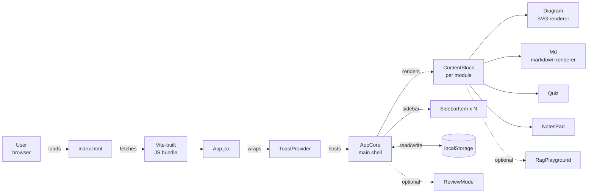
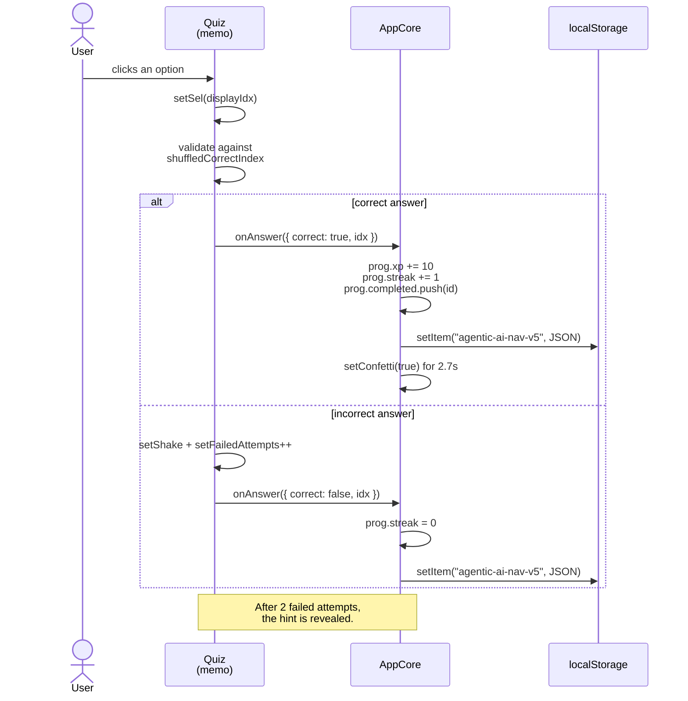
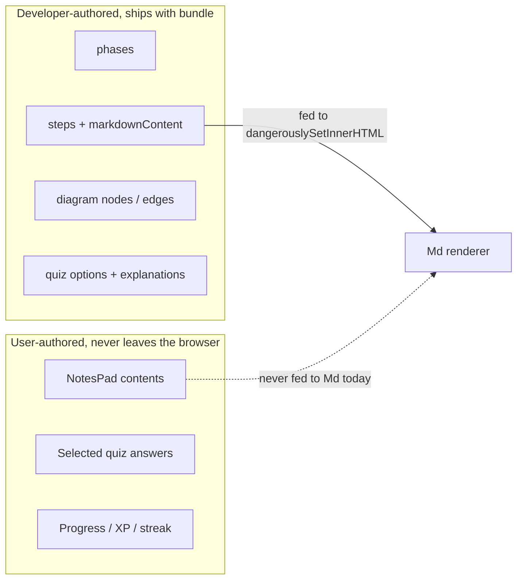
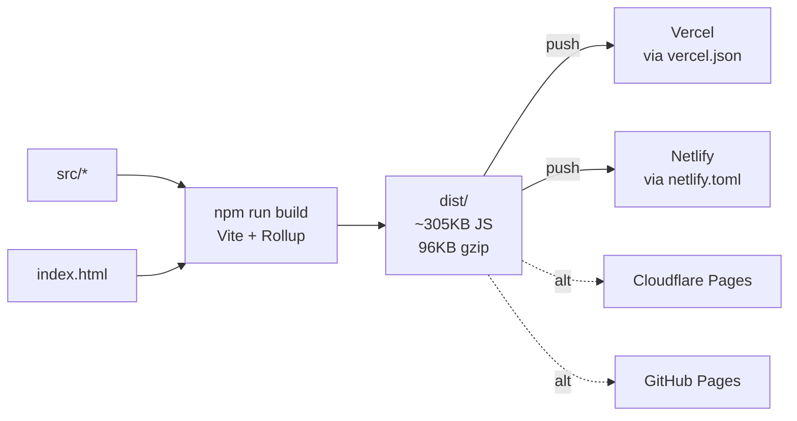

# Architecture

Agentic AI Navigator is a single-page React application. There is no server, no API, no authentication. Everything happens in the browser, and progress is persisted to `localStorage`. This document explains how the pieces fit together and where to look in the code.

## High-level flow



What the diagram says in words: the browser pulls `index.html`, which loads the Vite bundle, which mounts a tree rooted at `<App />`. `App` is just a `ToastProvider` around `AppCore`. `AppCore` owns all the navigation state and renders the active module's `ContentBlock`, which in turn composes a `Diagram`, `Md` text blocks, a `Quiz`, and a `NotesPad`. Progress and notes are synced to `localStorage` from `AppCore` and `NotesPad` respectively.

## Sequence: answering a quiz question



## What lives where

| Concern | File | Lines |
| --- | --- | --- |
| HTML shell, mount point | `index.html` | 1-13 |
| React root | `src/main.jsx` | 1-10 |
| Haptic helper | `src/App.jsx` | 1-14 |
| Phase definitions (6 phases) | `src/App.jsx` | 19-26 |
| Curriculum data (22 modules) | `src/App.jsx` | 28-568 |
| Storage helpers + schema key | `src/App.jsx` | 573-586 |
| ToastProvider + useToast | `src/App.jsx` | 591-620 |
| CSS variables and reset | `src/App.jsx` | 625-637 |
| Diagram SVG renderer | `src/App.jsx` | 642-813 |
| NotesPad | `src/App.jsx` | 818-891 |
| RagPlayground (interactive scenario) | `src/App.jsx` | 896-975 |
| ContentBlock (module shell) | `src/App.jsx` | 980-1005 |
| Md (markdown to HTML) | `src/App.jsx` | 1010-1024 |
| Quiz | `src/App.jsx` | 1029-1134 |
| ReviewMode | `src/App.jsx` | 1139-1182 |
| SidebarItem | `src/App.jsx` | 1187-1208 |
| AppCore (main shell, state hub) | `src/App.jsx` | 1213-1545 |
| Global styles | `src/App.jsx` | 1550-1593 |
| Default export wrapper | `src/App.jsx` | 1596-1597 |
| Vercel SPA + asset cache config | `vercel.json` | 1-13 |
| Netlify SPA redirect + build config | `netlify.toml` | 1-9 |
| Vite config | `vite.config.js` | 1-7 |
| ESLint flat config | `eslint.config.js` | 1-29 |

## State

The app holds two slices of state that survive page reloads.

### Progress slice (`agentic-ai-nav-v5` in localStorage)

Schema (from `defaultState` at `src/App.jsx:573`):

```jsonc
{
  "step": 0,           // 0-indexed position in the steps array
  "completed": [],     // step ids that have passed their quiz
  "xp": 0,             // running XP total
  "answers": {},       // map of stepId -> chosen original index
  "streak": 0,         // current correct-in-a-row streak
  "maxStreak": 0,      // best streak ever
  "started": 1700000000000  // first-visit timestamp
}
```

The `v5` suffix on the key means the schema has been broken (and old keys discarded) four times. A user with `v4` data on their machine will see their progress reset on first load. This is intentional; a future migration helper could lift forward old keys if that ever matters.

### Notes slice (`agentic-notes-<stepId>` in localStorage)

One key per module. Plain string. Written by `NotesPad` (`src/App.jsx:818-891`) with a 300ms debounce. Empty notes delete the key (line 837) so the storage map stays tight.

## Trust boundaries

The app has exactly one trust boundary worth mapping: the line between curriculum data (developer-authored, ships with the bundle) and notes (user-authored, lives only in their browser).



Today nothing user-authored is fed through the `Md` renderer (`src/App.jsx:1010-1024`), so the `dangerouslySetInnerHTML` call there is safe. If a future feature ever routes `NotesPad` content into `Md` (or any string the user could influence), the regex-based HTML construction becomes an XSS sink; add a sanitiser first.

## Invariants the design relies on

- **The seeded shuffle is deterministic.** `Quiz` reseeds an LCG with `stepId * 2654435761` (`src/App.jsx:1034`). Same `stepId`, same option order, every time. Refreshing the page does not reshuffle answers, so completed-quiz replay shows the same picks.
- **`isUnlocked(idx)` is the single gate for progression.** `idx === 0 || prog.completed.includes(steps[idx - 1]?.id)` (`src/App.jsx:1280`). The sidebar, the next button, and the keyboard shortcut all defer to this one expression.
- **Storage writes survive quota errors.** Both `saveToStorage` (`src/App.jsx:584-586`) and the notes writes (`src/App.jsx:840`) swallow exceptions. The app never crashes on a full disk, but the user also gets no signal.
- **`STORE_KEY` is bumped when the schema changes.** Old keys are not migrated. This is the only versioning mechanism.

## Build and deploy



Both Vercel and Netlify configs include an SPA fallback (any path returns `index.html`), so client-side navigation links work. Asset caching is set to one year via `vercel.json:6-12`.
